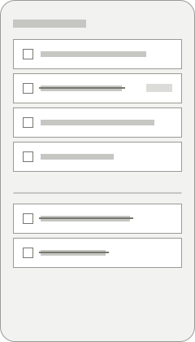
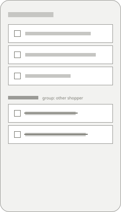
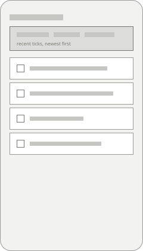

## Solution

When either shopper ticks an item, every other phone with the list open shows it ticked straight away. An item ticked by someone else is struck through where it is for five seconds, so the person looking at the list sees it happen, and then it drops to the bottom with the rest of the ticked items. Nothing moves under the shopper's thumb while they are reading the list: the drop waits until they have stopped scrolling.

A tick made without signal is kept on the phone and sent as soon as there is signal again. The shopper doesn't do anything and isn't told anything unless the tick still hasn't been sent a minute later, when a small note at the foot of the list says so.

## Sketches

-  — A shopper sees what the other person just picked up
-  — A shopper sees what the other person just picked up
-  — A shopper sees what the other person just picked up

## Design principles

1. The list the shopper is reading never moves under their thumb.
2. Seeing that the other person has it beats a shorter list.
3. Say nothing about the connection until it matters.

## Constraints

- A shop's signal drops for minutes at a time, so every tick has to survive being made offline and sent later.
- The shopping view is used one-handed at arm's length, so nothing here can depend on a swipe or a small target.

## Decisions

- Ticks go to other phones as they happen; text edits still sync when the list is opened — because ticks are what change in the shop, and text is written at home.
- The first tick of an item wins and a second changes nothing — because two people ticking the same item both meant "we have it".
- A remote tick is struck through in place, not grouped or listed in a strip above the list — because the other two sketches move the item away from where the shopper last saw it, which is the thing that made people lose their place.

## Artefacts

- [Accompanied shop, household 3](https://research.larder.example/studies/shared-lists/household-3)

## Notes

The list already syncs when it is opened; the gap is only while it stays open. Staff households have had the push behind a flag for two weeks, and the median delay between phones has been under a second on home wifi and between one and four seconds in shops, which is what the open question is about.
