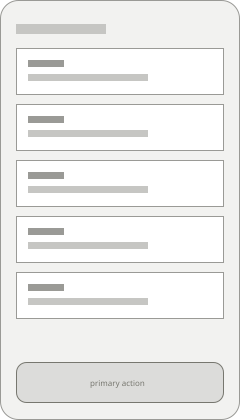
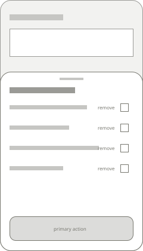

## Solution

The week's plan gets one action: Send to list. It adds every ingredient of every planned meal to the household's list, scaled to the number of people set on each meal, with the same ingredient across meals added together into one item. Before anything is added, a sheet shows what is about to arrive, and the planner can take items out of it.

Items that came from the plan remember it. Sending the plan again after a change updates those items — adds, removes, changes quantities — and never touches an item someone typed.

## Sketches

-  — A planner gets a list without copying anything
-  — A planner gets a list without copying anything

## Decisions

- Show what is about to be added before adding it — because a plan sent straight to a shared list is fifteen items the other person didn't ask for.
- Items from the plan are updated by sending again, never duplicated — because people change the plan midweek and expect the list to follow.

## Notes

Quantities are already structured on Larder's own recipes (amount, unit, ingredient), so adding them together is arithmetic for matching units. Mixed units are the open question.
